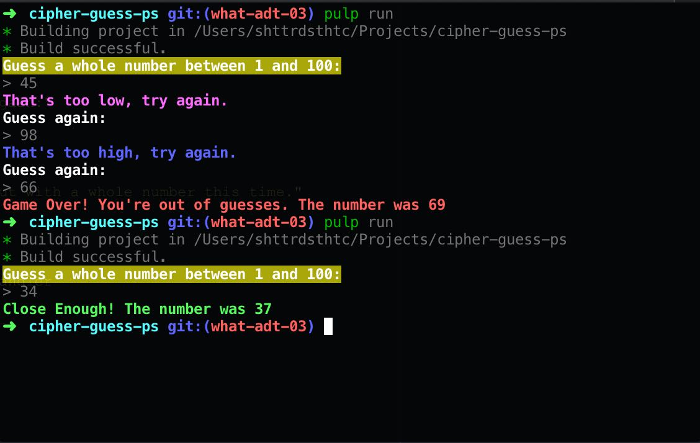

## Purescript, Part 3: Colorized

[Code for this post](https://gitlab.com/shatteredaesthetic/cipher-guess-ps/tree/what-adt-03) is here. Next features, new branch! Hooray!

#### First, a correction

The game played _mostly_ right. We meant to limit ourselves to 3 guesses, but instead we got 4. This is a simple fix:

```haskell
logic g { low: l, high: h, tolerance: tol } (GameState guesses t)
  | guesses == 1 = do
    tell $ A.singleton $ wrong $ "Game Over! You're out of guesses. The number was " <> show t
    pure Nothing
```

We check to see if the guesses equal 1 instead of 0. Now we have three guesses. Solved.

Also, I didn't like how it asked for the number after every guess, so I moved that question to `main`:

```haskell
main :: Effect Unit
main = void do
  let env = gameEnvironment 1 100 3
  rnd <- randomInt 1 100
  log "Guess a whole number between 1 and 100:"
  runGame env $ GameState 3 rnd
```

Okay, let's continue.

#### Let's Get On To Coloring

We're on the terminal, so the easiest way to color the output is to use ANSI codes. We can add them to the text that gets logged. Easy peasy. Let's look at the codes as a reference:

```
Black: \x1b[30m
Red: \x1b[31m
Green: \x1b[32m
Yellow: \x1b[33m
Blue: \x1b[34m
Magenta: \x1b[35m
Cyan: \x1b[36m
White: \x1b[37m
Reset: \x1b[0m
```

We'll add the color to the beginning of the string, and add the reset to the end.

Of course, adding it to each string would be quite repetitive, and wouldn't read very well, so why don't we create some helper functions. Here's a new module for them:

```haskell
win :: String -> String
win str =
  "\x1b[32;1m" <> str <> "\x1b[0m"

high :: String -> String
high str =
  "\x1b[34;1m" <> str <> "\x1b[0m"

high' :: String -> String
high' str =
  "\x1b[34m" <> str <> "\x1b[0m"

low :: String -> String
low str =
  "\x1b[35;1m" <> str <> "\x1b[0m"

low' :: String -> String
low' str =
  "\x1b[35m" <> str <> "\x1b[0m"

wrong :: String -> String
wrong str =
  "\x1b[31;1m" <> str <> "\x1b[0m"

bright :: String -> String
bright str =
  "\x1b[37;1m" <> str <> "\x1b[0m"

bg :: String -> String
bg str =
  "\x1b[43;1m" <> str <> "\x1b[0m"
```

We have a function for winning, for being wrong, and different functions for high and low, depending on how far off we are. We also made some others just to make things pretty. You may have noticed the `;1` added and thought, "what's that?" It makes the text brighter. Let's see what `logic` looks like with our new pretty things:

```haskell
import Color (wrong, win, high, high', low, low')

logic g { low: l, high: h, tolerance: tol } (GameState guesses t)
  | guesses == 1 = do
    tell $ A.singleton $ wrong $ "Game Over! You're out of guesses. The number was " <> show t
    pure Nothing
  | g < l = do
    tell $ A.singleton $ low' "Too low for bounds."
    pure $ Just $ GameState (guesses - 1) t
  | g > h = do
    tell $ A.singleton $ high' "Too high for bounds."
    pure $ Just $ GameState (guesses - 1) t
  | t == g = do
    tell $ A.singleton $ win "That's it, Exactly!"
    pure Nothing
  | g < t - tol = do
    tell $ A.singleton $ low "That's too low, try again."
    pure $ Just $ GameState (guesses - 1) t
  | g > t + tol = do
    tell $ A.singleton $ high "That's too high, try again."
    pure $ Just $ GameState (guesses - 1) t
  | otherwise = do
    tell $ A.singleton $ win $ "Close Enough! The number was " <> show t
    pure Nothing
```

And, of course, here's our new `lineHandler` function, with the helpers:

```haskell
import Color (bg, bright, wrong)

lineHandler input =
  case fromStringAs decimal input of
    Just guess -> do
      let Tuple result written = evalRWS (game guess) env state
      for_ written log
      case result of
        Nothing -> do
          RL.close interface
        Just newSt -> do
          log $ bright "Guess again:"
          RL.close interface
          runGame env newSt
    Nothing -> do
      log $ wrong "Try again, but with a whole number this time."
      RL.close interface
      runGame env state
```

And the relevant line in `main`:

```haskell
log $ bg "Guess a whole number between 1 and 100:"
```

#### Section: The End

That's all, folks! Now our output has some nice coloring, making it easier to see our results at a glance. Let's see what it looks like:



Now, isn't that sweet? You're probably thinking, "that was a short post. What gives?" You'd be right. We'll get to more functionality next time. One guess seems kind of...short. One number to guess is no bueno, so next time we're going to extend the game to more targets if the player gets a guess within tolerance. Stay tuned...
